# Field Report System

**Serverless field operations platform — AWS Lambda, API Gateway, DynamoDB, SNS, Cognito**



---

## The Problem

I spent several years working as a field technician for a commercial water well contractor. Every job ended the same way: paper. Pump installation reports, time and material sheets, flow test data — all written by hand on forms that went into a filing cabinet. Monday mornings, a supervisor reconciled every paper sheet against a separate mobile app before anything could go to payroll. Office staff manually re-typed field reports into digital records. Looking up historical data meant pulling boxes.

The cost is real: supervisor time, data entry time, transcription errors, and a records system that makes anything older than last week slow to find.

This project replaces that entire chain. A supervisor dispatches a field tech onto a job from a dashboard. The tech opens their phone, sees their assignment, pulls up the last cleaning report and pump test for the well they're heading to, and has everything they need before they turn a wrench. When the work is done, they fill out and submit their forms from the same phone. If the foreman still wants to use paper forms on site, he photographs them — the system handles the rest. No re-typing. No paper reconciliation. No Monday morning bottleneck.

This is **Project A** of a three-part system:

| Project | Repo | What It Does |
|---|---|---|
| **A — Field Report System** | this repo | Mobile field operations platform — dispatch, historical lookup, form submission |
| **B — Field Ops Platform** | [field-ops-platform](https://github.com/leyder-ben/field-ops-platform) | EKS GitOps platform — supervisor dashboard, job management |
| **C — Field Report Pipeline** | [field-report-pipeline](https://github.com/leyder-ben/field-report-pipeline) | AI document pipeline — classifies and extracts data from scanned paper forms |

All three projects share a single DynamoDB table for documents and a common SNS notification channel. A supervisor sees every field record in one place regardless of whether it came from a digital form submission, a photographed paper form, or an archival scan.

---

## Architecture


| Tier | Service | Role |
|---|---|---|
| Identity | Cognito — SMS OTP | Field tech and foreman authentication — phone number based, no passwords |
| Field UI | Mobile Web App (S3 static site) | Tech dashboard — assigned jobs, historical records, form submission |
| API | API Gateway REST | Receives requests, validates JWT tokens from Cognito, invokes Lambda |
| Processing | Lambda — process_report (Python 3.12) | Validates, routes, writes records, publishes notifications |
| AI Summary | Bedrock — Claude Sonnet 4.6 | Generates plain-English summaries of submitted field reports |
| AI Ingestion | Project C Pipeline (S3 trigger) | Classifies and extracts data from photographed paper forms |
| Storage — Documents | DynamoDB — field-reports | All field documents — shared table with Projects B and C |
| Storage — Jobs | DynamoDB — jobs | Dispatched service calls — open/closed lifecycle |
| Storage — Assets | DynamoDB — assets | Wells, pumps, and infrastructure owned by customers |
| Storage — Customers | DynamoDB — customers | Customer records with file numbers |
| Photo Storage | S3 — photos bucket | Private — accessed via presigned URLs only |
| Notification | SNS | Emails office on document submission |
| Observability | CloudWatch | Logs, error alarms, duration alarms, dashboard |
| Secrets | Secrets Manager | Config values off environment variables |
| Identity (CI/CD) | IAM + GitHub OIDC | Least-privilege deploy role — no stored AWS credentials |
| IaC | Terraform | Every resource provisioned as code |
| CI/CD | GitHub Actions | Deploys Lambda and UI on push to main |

---

## Data Model

The system is organized around a four-level hierarchy:

```
Customer  >  Asset  >  Job  >  Document
```

**Customer** — the organization that owns the wells and equipment being serviced. Stores name, type (municipal, commercial, industrial), and the contractor's internal file number.

**Asset** — a specific well, pump, or piece of infrastructure owned by a customer. A customer can have dozens of assets. Each asset carries its own service history independent of the others.

**Job** — a dispatched service call against a specific asset. A job has a lifecycle: dispatched (open) → worked → closed. While a job is open, documents can be added and edited freely. When a job closes, all documents lock permanently.

**Document** — any field record produced during or before a job. Cleaning logs, flow tests, pump set records, T&M sheets, timesheets, expense reports. All documents are mutable while the parent job is open. Once the job closes, the record is final.

### Document Behavior

Every document type follows the same rules:

- **Editable** while the job is open — a foreman can update the T&M sheet on Tuesday with work done Monday
- **Appendable** — a second flow test can be added to a job if the first one didn't hit the target
- **Locked** when the job closes — close-out is the equivalent of merging a dev branch to main

The version counter and `last_modified` timestamp on every document provide an audit trail for all edits.

### DynamoDB Tables

**`customers`** — PK: `customer_id`

**`assets`** — PK: `asset_id` | GSI: `customer_id`

**`jobs`** — PK: `job_id` | GSIs: `asset_id`, `customer_id`, `assigned_techs + status`

**`field-reports`** (Documents) — PK: `report_id`, SK: `submitted_at` | GSIs: `job_id`, `asset_id + document_type`, `customer_id + document_type`, `submitted_by`

Document records carry `job_id`, `asset_id`, and `customer_id` as denormalized fields. DynamoDB doesn't do joins — storing these values directly on the document enables single-query access for every query pattern the supervisor dashboard needs: all flow tests for a specific well, all well logs for a specific customer, all documents on a specific job.

### Document Types

| document_type | Description |
|---|---|
| `cleaning_log` | Well Cleaning Log — updated daily as work progresses |
| `flow_test` | Flow Test / Pumping Test — specific capacity, water levels, GPM |
| `pump_set` | Pump Set Record — bowl assembly, column pipe, motor specs |
| `well_log` | Driller's log — formation descriptions, casing, screen specs |
| `t_and_m` | Time and Material Sheet — labor, materials, equipment |
| `timesheet` | Weekly Timesheet — daily hours across multiple jobs |
| `expense` | Expense Report — lodging, fuel, per diem |
| `pump_install` | Pump Installation Record — installation specs, startup readings |
| `fire_pump_test` | Fire Pump Test — NFPA 25 acceptance test data |
| `observation_well` | Observation Well — static level measurements over time |
| `sales_order` | Sales Order — dispatcher-issued work authorization |
| `maintenance_report` | General Maintenance — catch-all for other work types |

---

## How It Works

### Job Dispatch (Supervisor → Tech)

A supervisor creates a job from the Project B dashboard — selects the customer, the asset (specific well or pump), the job type, and which techs are dispatched. The job lands in the `jobs` table with status `open` and the assigned tech IDs attached.

### Tech View (Field)

The tech opens the mobile web app on their phone. After SMS OTP login through Cognito, they see their assigned open jobs. Tapping into a job shows two things:

1. **Historical records for that asset** — the latest version of each document type on file for that specific well or pump. Last cleaning report. Last pump test. Pump set record. Well log. Read-only reference material so the tech knows what they're walking into before they start work.

2. **Working documents for this job** — forms in draft state. The tech can create new documents, edit existing ones, and add additional records of the same type as needed throughout the job.

### Form Submission

Tech fills out a form on their phone. If there's a photo (site conditions, equipment nameplate, test gauge reading), the form fetches a presigned PUT URL from the API and uploads the photo directly to S3 — the photo never passes through Lambda. The form data POSTs to API Gateway, Lambda validates and writes the record to DynamoDB, Bedrock generates a plain-English summary, and SNS notifies the office.

The DynamoDB write happens first. Bedrock runs after. A model availability issue never loses a submitted report.

### Photo-to-Pipeline Path

A foreman who wants to use paper forms in the field photographs the completed form from the mobile app. That image uploads to S3 and triggers the Project C pipeline — Textract extracts the text, Bedrock classifies the document type and extracts the structured fields, and the result lands in `field-reports` just like a digitally-submitted record. The office sees it the same way. The foreman doesn't need to know any of that is happening.

This is the migration path. A contractor doesn't have to mandate digital forms on day one. Paper and digital run in parallel. The supervisor sees both in the same dashboard.

### Job Close-Out

When the work is done, a supervisor closes the job from the Project B dashboard. All attached documents flip from `draft` to `final`. Nothing changes after that. The closed job becomes the permanent service record for that asset — visible to the manager whenever they pull up that well's history.

---

## Visibility Rules

**Supervisor:** Full access. All customers, assets, jobs, documents. Can dispatch and close jobs.

**Field Technician:** Sees only jobs they are dispatched on. Can view historical records for the asset on their assigned job. Can create and edit documents on open assigned jobs. Can view their own personal records (timesheets, T&M sheets, expense reports) across all jobs they've worked.

**Foreman (elevated field role):** Same as tech plus photo-to-pipeline upload capability. Job close-out authority is an open architecture decision pending ADR.

---

## Repository Structure

```
field-report-system/
├── lambda/
│   └── process_report/
│       ├── handler.py          # Lambda — routes GET, POST, presigned URL requests
│       └── requirements.txt
├── ui/
│   └── index.html              # Mobile web app — single file, no framework, no build step
├── infra/                      # Terraform — all AWS resources
│   ├── main.tf                 # Provider config, S3 remote state backend
│   ├── variables.tf
│   ├── outputs.tf
│   ├── dynamodb.tf             # field-reports, jobs, assets, customers tables
│   ├── sns.tf                  # Notification topic (shared with Projects B and C)
│   ├── s3.tf                   # Photos bucket (private), UI static site (public)
│   ├── lambda.tf               # Lambda function, CloudWatch log group
│   ├── api_gateway.tf          # REST API, CORS, request validation, Cognito authorizer
│   ├── iam.tf                  # Lambda exec role, GitHub Actions OIDC deploy role
│   ├── secrets.tf              # Secrets Manager
│   └── cloudwatch.tf           # Error alarms, duration alarm, dashboard
├── .github/
│   └── workflows/
│       └── deploy.yml          # CI/CD — triggers on lambda/**, ui/**, .github/** changes
└── README.md
```

---

## Build and Deploy

**Prerequisites:** AWS CLI configured, Terraform installed, Python 3.12

```bash
git clone git@github.com:leyder-ben/field-report-system.git
cd field-report-system/infra
terraform init
terraform plan
terraform apply
```

After apply:

```bash
aws s3 sync ui/ s3://<ui-bucket-name>/ --delete
```

CI/CD handles deploys from there. Pushing to `main` triggers the GitHub Actions workflow — packages Lambda, deploys it, syncs the UI bucket. Fires only on changes to `lambda/`, `ui/`, or `.github/workflows/`. Doc-only commits don't trigger a deploy. GitHub authenticates to AWS via OIDC — no stored access keys.

---

## Troubleshooting

*Real issues hit during the build. The kind that don't show up in tutorials.*

**DynamoDB tag value rejected — `ValidationException`**
Tag values with em dashes or commas blow up at apply time. The error says "invalid characters" but won't tell you which ones. Keep DynamoDB tag values plain ASCII — no punctuation beyond spaces.

**GitHub OIDC provider already exists — `EntityAlreadyExists`**
Only one GitHub OIDC provider per AWS account. If another project already created it, Terraform fails trying to create a second. Fix: `terraform import aws_iam_openid_connect_provider.github <existing-arn>`.

**S3 bucket policy rejected — `AccessDenied: BlockPublicPolicy`**
Race condition between the public access block resource and the bucket policy. Terraform applied the policy before AWS propagated the block settings. Fix: add `depends_on = [aws_s3_bucket_public_access_block.ui]` to the bucket policy resource.

**API Gateway integration response — `NotFoundException`**
OPTIONS mock integration response tried to create before the mock integration was registered. Fix: explicit `depends_on` on both the integration and the method response. API Gateway has propagation delays Terraform's implicit dependency graph doesn't always catch.

**CloudWatch dashboard — `InvalidParameterInput: Should have required property 'region'`**
Every widget's `properties` block needs an explicit `region` field. Terraform doesn't infer it from the provider. Add `region = var.aws_region` to every widget.

**Bedrock `ValidationException` — on-demand throughput not supported**
AWS requires cross-region inference profile IDs for on-demand Bedrock calls. `anthropic.claude-...` won't work. Use `us.anthropic.claude-...` — the `us.` prefix selects the US cross-region inference profile.

**Bedrock `ResourceNotFoundException` — model marked as legacy**
Claude 3 Haiku and Claude 3.5 Haiku are both blocked on this AWS account despite showing ACTIVE in the inference profile list. Upgraded to Claude Sonnet 4.6 (`us.anthropic.claude-sonnet-4-6`). Before specifying any Bedrock model, run `aws bedrock list-foundation-models --by-provider Anthropic` and confirm status is `ACTIVE`. Then test with a direct invocation — ACTIVE in the list does not guarantee the model is accessible if a Marketplace subscription is also required.

**GitHub Actions `wait function-updated` — `AccessDeniedException`**
`aws lambda wait function-updated` polls `GetFunctionConfiguration` internally — a separate IAM permission from `GetFunction`. Added `lambda:GetFunctionConfiguration` to the deploy role.

---

## How This Connects to Projects B and C

**Project B** runs the supervisor dashboard on EKS. The dashboard reads from all four DynamoDB tables — dispatches jobs, monitors active work, closes jobs, and pulls historical reports across any asset or customer. What the field tech sees as their job assignment was created here.

**Project C** is the AI ingestion pipeline. When a foreman photographs a paper form through the mobile UI, Project C classifies the document, extracts the structured data, and writes it to `field-reports`. The supervisor sees it alongside digital submissions in the Project B dashboard. One database. Two submission paths. No ultimatums about going paperless overnight.

---

## About This Project

Built as part of a portfolio demonstrating AWS cloud engineering — serverless architecture, infrastructure as code, CI/CD automation, and practical AI integration. The problem domain comes from firsthand experience in the water well contracting industry.

All test data uses the fictional contractor Wolverine Water, Inc. (Millbrook, Indiana) and four fictional customers:

- Harlan County Rural Water District — municipal water district, File No. 447
- Stover Industrial Park — commercial facility, Kokomo, Indiana, File No. 831
- Birch Creek Township Water Authority — municipal water authority, File No. 612
- Dresser Aggregates, Inc. — aggregate plant, Mentone, Indiana, File No. 204

No real customer, employee, or operational data appears anywhere in this repository.